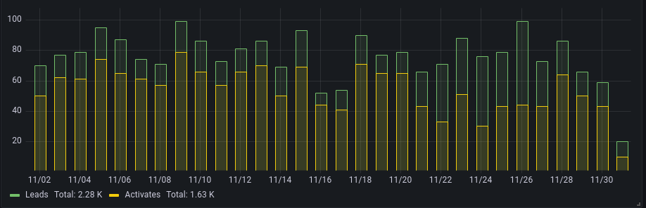
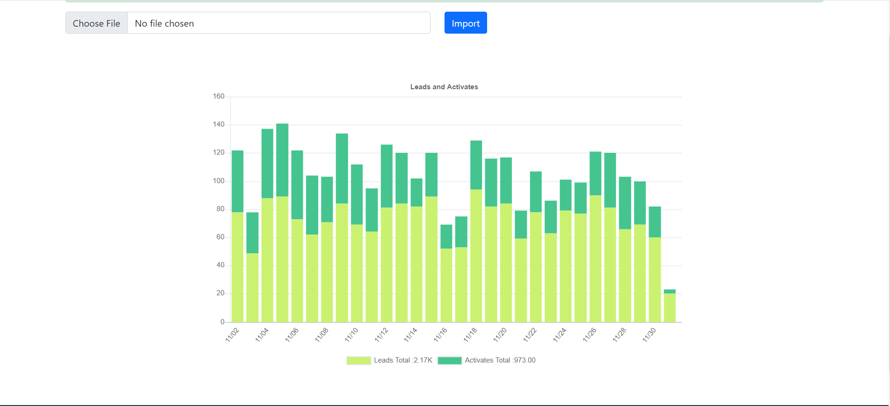

Task
===

1. Import data from Explore-data.csv to Mysql database (Time:microseconds,Leads:int,Activates:int)   Done
2. Backend : Create JSON API in public/api.php for Frontend AJAX request Done
3. Frontend : Create Visual Graf in public/index.html Done
4. Install with composer needed packages (optional) Used

a sample can you see in line_graph.png, or you can use line charts, for example:
https://www.chartjs.org/docs/latest/
https://www.w3schools.com/js/js_graphics_chartjs.asp

 
 

Result:
===
zip file with source code and SQL data export, without vendor folder  

==>     Removed  Vendor Folder  and attached source code, Sql file. 

p.s. if you use composer, then not forget to include composer.lock 

==>     included too

Well, I wish you a nice week!
